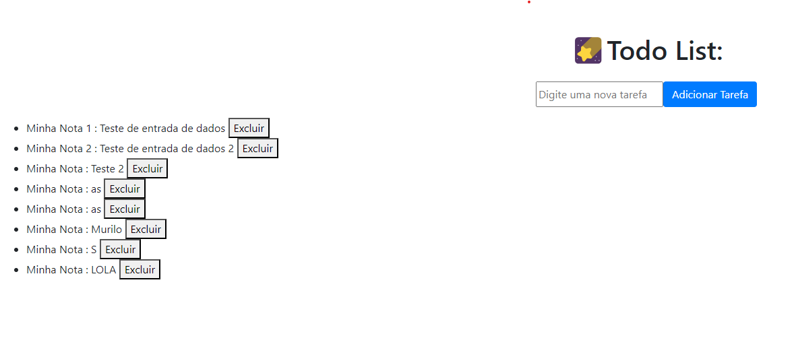

# Template para avaliação P2

Saída esperada após execução do programa:



# IMPORTANTE:

Para colocar o frontend para funcionar, colocar uma máquina EC2 rodando o Apache WebServer.
Para isso, instalar dentro da EC2:

```bash
sudo apt update
sudo apt upgrade
sudo apt install apache2
# os arquivos do projeto devem estar em /var/www/html
git clone https://github.com/Murilo-ZC/Avaliacao-P2-M7-2023-EC.git
sudo cp ./Avaliacao-P2-M7-2023-EC/frontend /var/www/html
```

Aqui pessoal, os arquivos já estaram disponíveis na porta 80, não necessário redirecionar.

> IMPORTANTE: Verificar as rotas e utilziar o seu próprio repositório com as modificações realizadas.
